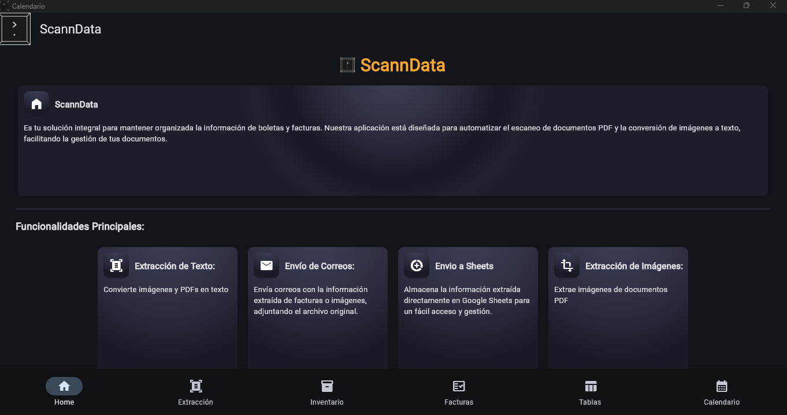
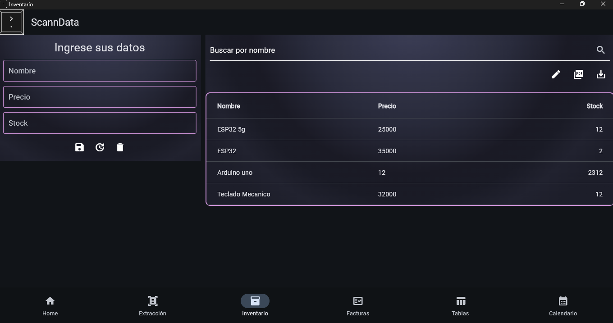
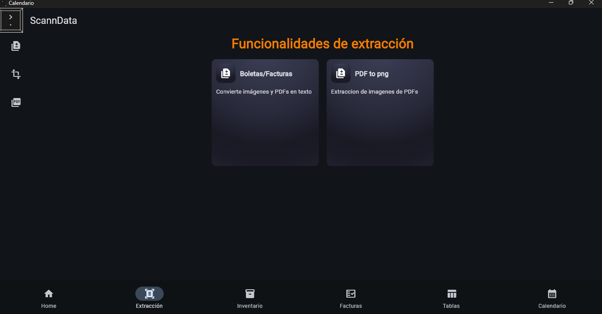
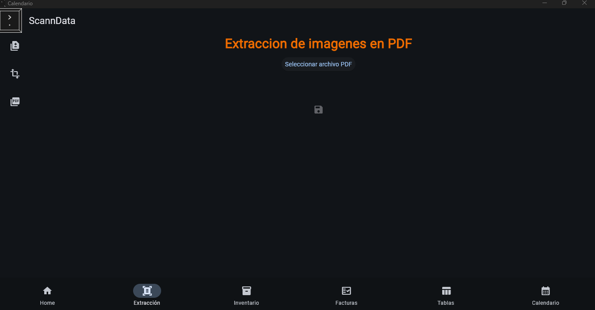
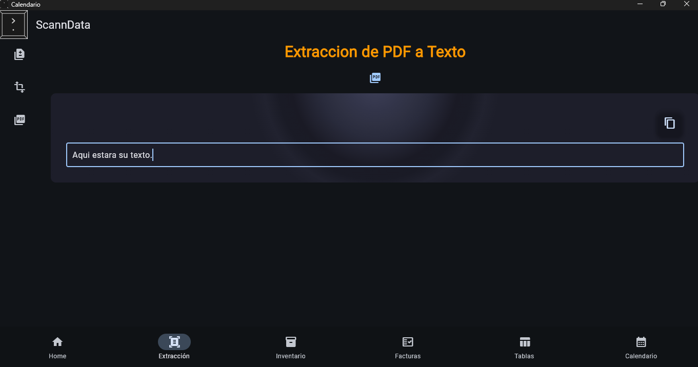
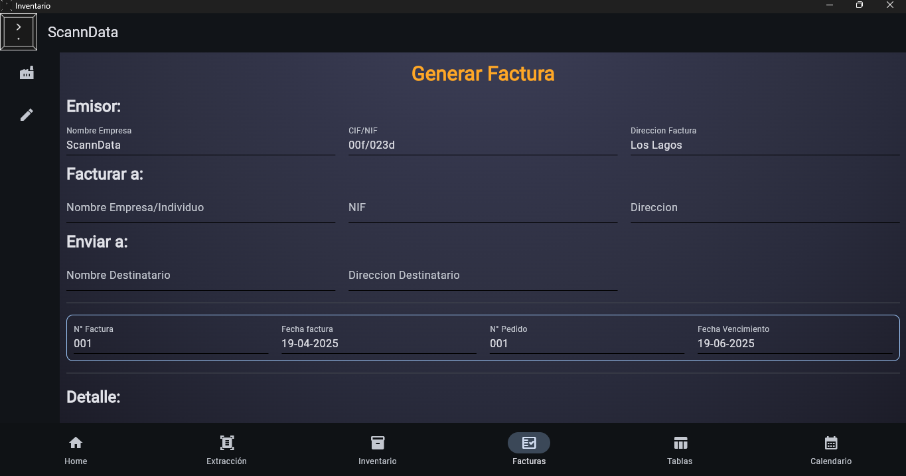
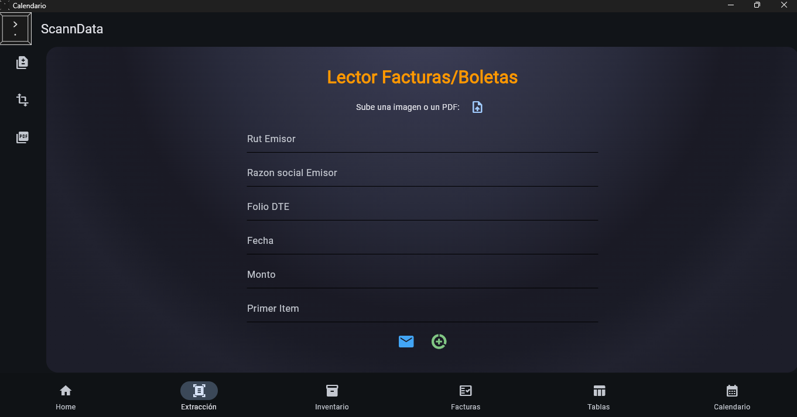
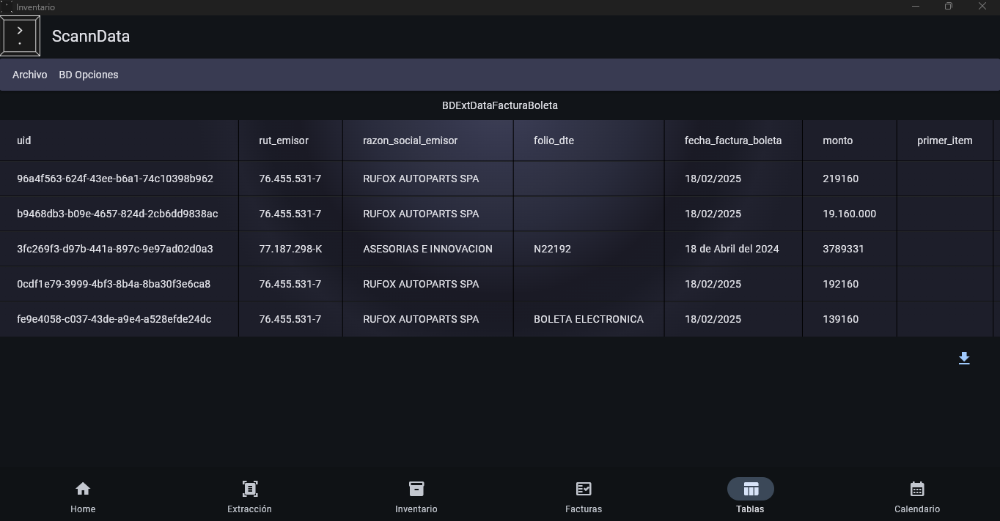
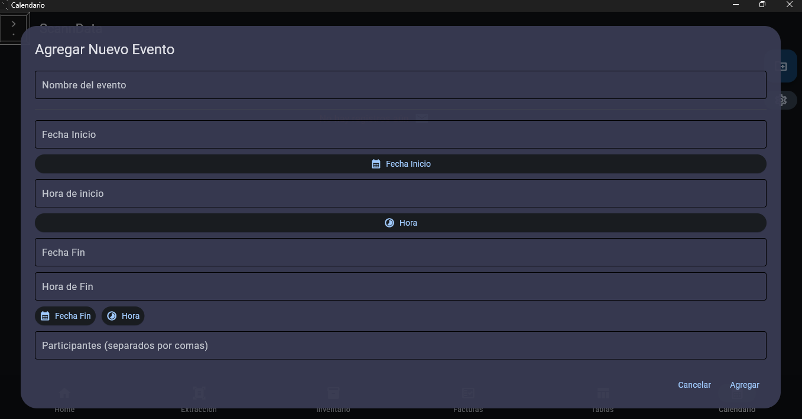

# Bienvenido a ScannData

**ScannData** es tu solución integral para mantener organizada la información de boletas y facturas. Nuestra aplicación está diseñada para automatizar el escaneo de documentos PDF y la conversión de imágenes a texto, facilitando la gestión de tus documentos.

## Índice 📌
- [Funcionalidades Principales](#funcionalidades-principales)
- [¿A Quién Está Dirigida?](#a-quién-está-dirigida)
- [Mensaje de Bienvenida](#mensaje-de-bienvenida)
- [Instalación](#instalación)
- [Función Extraction](#función-extraction)
- [Función Proceso](#función-proceso)
- [Demo ScannData](#demo-scanndata)

## Funcionalidades Principales

- **Extracción de Texto**: Convierte imágenes y PDFs en texto.
- **Extracción de Imágenes**: Extrae imágenes de documentos PDF.
- **Envío de Correos Personalizados**: Envía correos con la información extraída de facturas o imágenes, adjuntando el archivo original.
- **Guardado en Google Sheets**: Almacena la información extraída directamente en Google Sheets para un fácil acceso y gestión.

## ¿A Quién Está Dirigida?

ScannData está diseñada tanto para usuarios individuales como para empresas que buscan una gestión eficiente de boletas y facturas. Es especialmente útil para personas que trabajan con información o datos de manera regular.

## Mensaje de Bienvenida

¡Bienvenido a ScannData! Estamos aquí para ayudarte a simplificar y automatizar la gestión de tus documentos. Explora nuestras funcionalidades y descubre cómo podemos facilitar tu trabajo diario.

---

Esperamos que disfrutes de tu experiencia con ScannData. Si tienes alguna pregunta o necesitas asistencia, no dudes en contactarnos.

---------
### Install

- pip install -r requirements.txt

- Download Tesseract-OCR

----
### Funcion Extraction

Extraccion de data de boletas, pdf o imagen

Rut Emisor:
Razon social Emisor:
Folio DTE:
Fecha
Mont
Primer Item

btn
- Ingrsar factura (a una base de datos en base de datos sheet.)

-----
### Funcion proceso
Se podra guardar la informacion que se requiera directamente hacia:
- googlesheet
- supabase (base de datos online)

--------------
## Demo ScannData

>Home

> Inventario

> Extraccion Home

> Extraccion Imagenes de PDF

> Extraccion de Texto de PDF

> Generar Facturas

> Ver inventario

> Extraccion de imagen o pdf a formato de boleta

> Tablas de Google sheet

> Agregando evento al google calendar

<video controls autoPlay loop muted width="600">
  <source src="https://github.com/lllit/scanndata-/raw/main/demo_images/demo-calendario.mp4?raw=true" type="video/mp4" />
</video>
